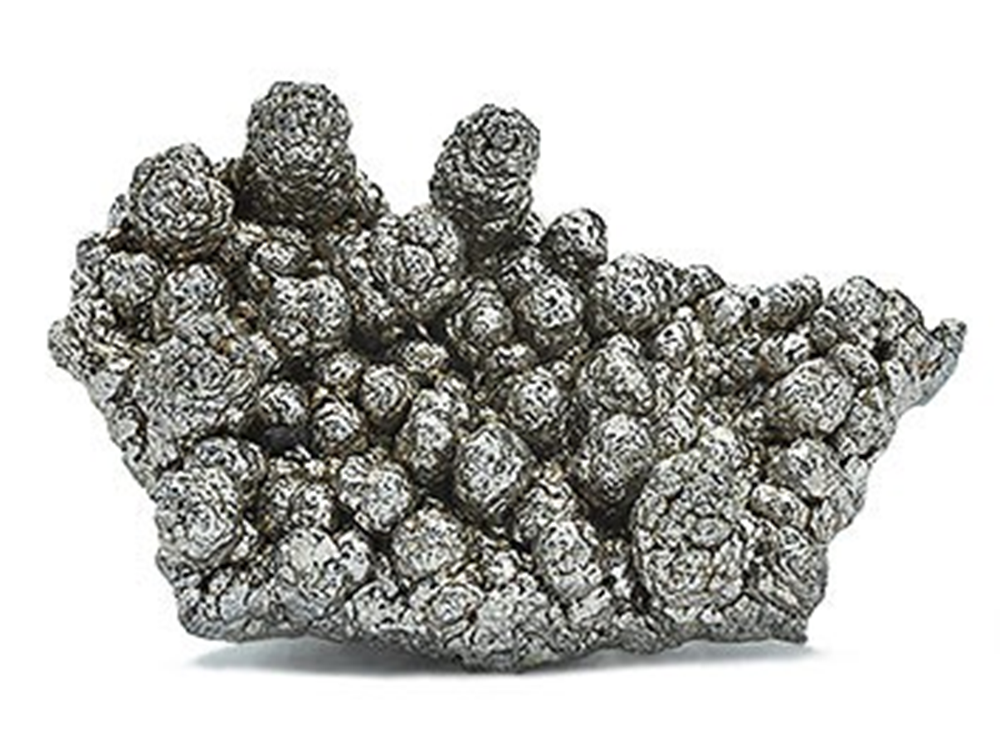

# Mangan
Chemisches Elemente **Mn** mit der Ordnungszahl 25 und Übergangsmetall.

| Eigenschaft | Wert |
| ----------- | ---- |
| Dichte $[kg/m^3]$ | $7470$ |
| Schmelztempertur $[°C]$ | $1244$ |
| E Modul $[N/m^2]$ | $1.9\cdot 10^{10}$ |
| Zugfestigkeit $[N/m^2]$ |  $8-10\cdot 10^{8}$ |
| $R_{0.2}$ | $3.5\cdot 10^{8}$ | 
| Bruchdehnung $[%]$ | $35$ |
| Querkontraktion $[-]$ | $ $ |
| Wärmeausdehnungskoeffizient |  |
| Wärmeleitfähigkeit $[W/(m \cdot K)]$  |7.82  |
| Wärmekapazität $[J/(kg \cdot K)]$  | 480  |
| elektrische Leitfähigkeit |  |

## Kristallstruktur
Tritt in $\alpha$ Mangan als kubisch raumzentriert und $\beta$ Mangan als kubisch primitiv auf.